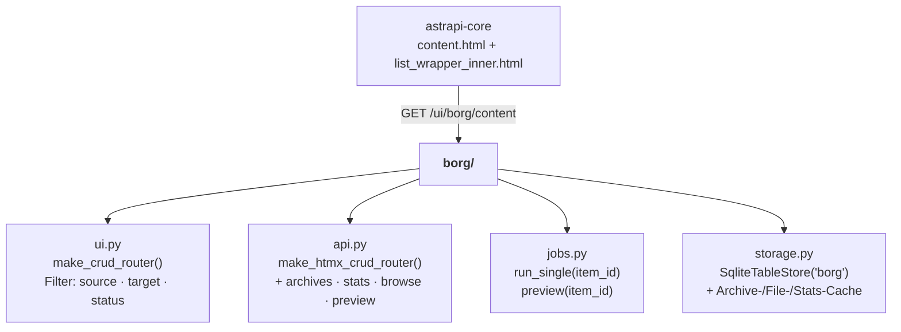
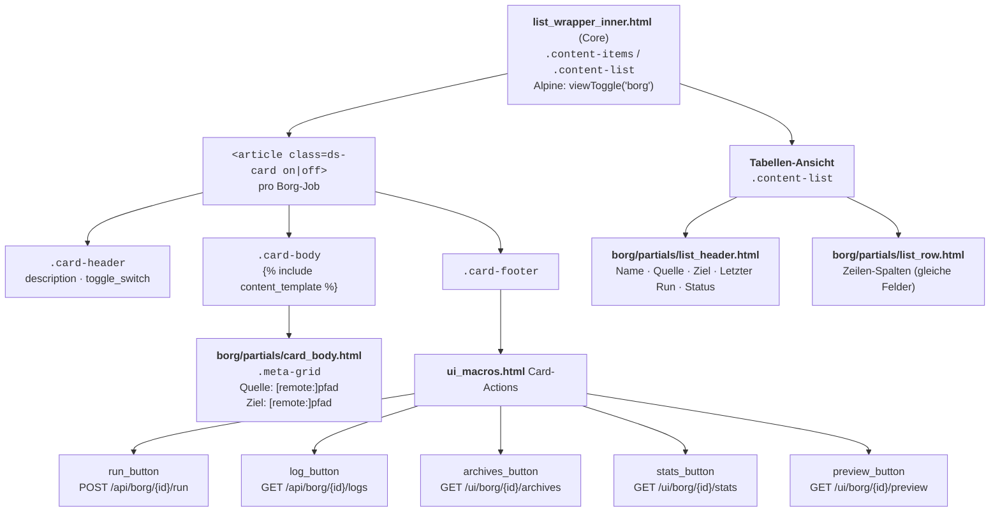
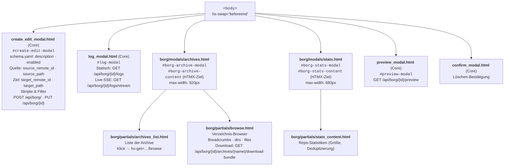
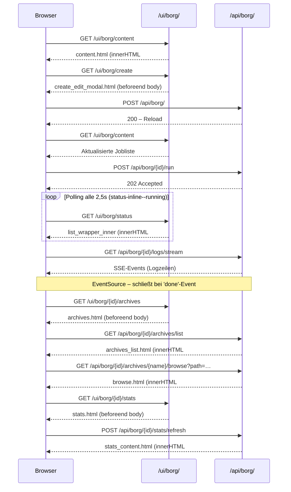
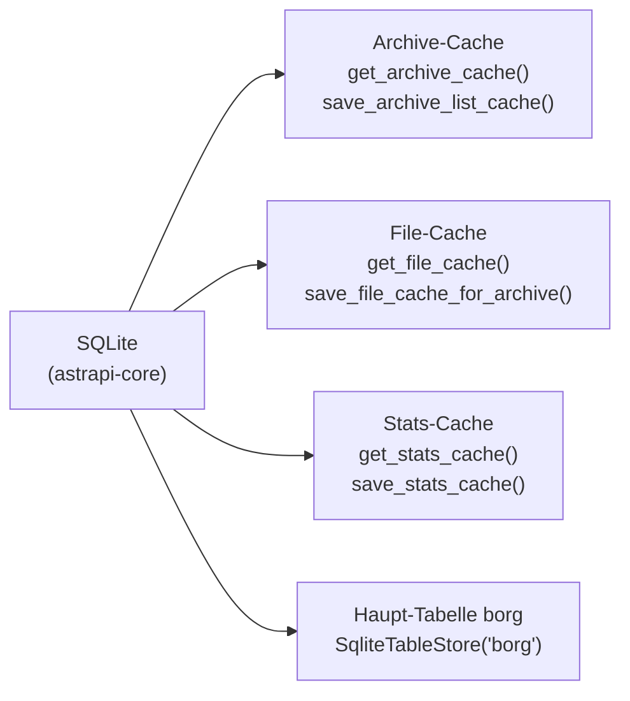

# UI-Komponenten-Architektur – Modul Borg

Template-Hierarchie, CSS-Klassen und HTMX-Interaktionsmuster spezifisch für das Borg-Backup-Modul.

---

## 1 · Modulstruktur im Überblick

---

## 2 · Vollständige Template-Hierarchie

---

## 3 · Filter-Leiste (content-header)

```mermaid
flowchart LR
    header["<code>.content-header-actions</code>"]
    header --> f1["<select> Quelle<br/>GET /api/remotes/for-select?type=borg_source"]
    header --> f2["<select> Ziel<br/>GET /api/remotes/for-select?type=borg_target&local=0"]
    header --> f3["<select> Status<br/>neu · ok · error"]
    header --> add["<b>add_button</b><br/>GET /ui/borg/create"]
```

---

## 4 · Modal-Dialoge

---

## 5 · HTMX-Datenfluss Borg

---

## 6 · API-Endpunkte (Borg)

| Methode | Pfad | Beschreibung |
|---|---|---|
| `GET` | `/ui/borg/content` | Vollständige Jobliste (content.html) |
| `GET` | `/ui/borg/status` | Polling-Schnappschuss (laufende Jobs) |
| `GET` | `/ui/borg/create` | Create-Modal |
| `GET` | `/ui/borg/{id}/edit` | Edit-Modal |
| `GET` | `/ui/borg/{id}/archives` | Archives-Modal |
| `GET` | `/ui/borg/{id}/stats` | Stats-Modal |
| `GET` | `/ui/borg/{id}/preview` | Preview-Modal |
| `POST` | `/api/borg/` | Job anlegen |
| `PUT` | `/api/borg/{id}` | Job bearbeiten |
| `DELETE` | `/api/borg/{id}` | Job löschen |
| `POST` | `/api/borg/{id}/run` | Backup starten |
| `GET` | `/api/borg/{id}/logs` | Log (statisch, optional `?date=`) |
| `GET` | `/api/borg/{id}/logs/stream` | Log-SSE-Stream |
| `GET` | `/api/borg/{id}/archives/list` | Archivliste (cached) |
| `POST` | `/api/borg/{id}/archives/refresh` | Archivliste neu laden |
| `GET` | `/api/borg/{id}/archives/{name}/browse` | Verzeichnis-Browser |
| `GET` | `/api/borg/{id}/archives/{name}/download-bundle` | TAR-Download |
| `GET` | `/api/borg/{id}/stats` | Stats (cached) |
| `POST` | `/api/borg/{id}/stats/refresh` | Stats neu laden |
| `GET` | `/api/borg/{id}/preview` | Vorschau (dry-run) |

---

## 7 · Cache-Schichten (storage.py)

