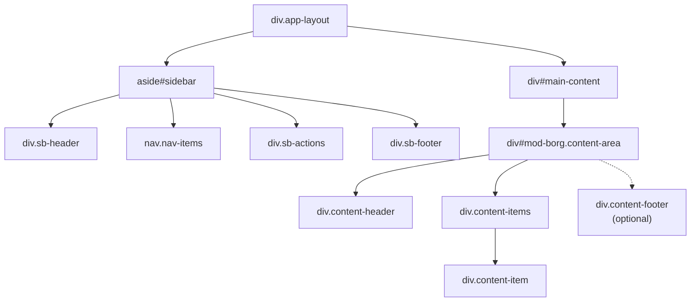
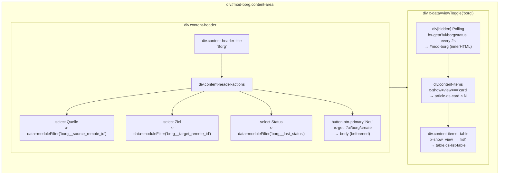

# DOM-Struktur – Modul Borg

## 1 · Haupt-Layout

```mermaid
flowchart TD
    layout["div.app-layout"]
    sidebar["aside#sidebar"]
    main["div#main-content"]
    
    s_header["div.sb-header"]
    s_nav["nav.nav-items"]
    s_actions["div.sb-actions"]
    s_footer["div.sb-footer"]

    c_area["div#mod-borg.content-area"]
    c_header["div.content-header"]
    c_items["div.content-items"]
    c_item["div.content-item"]
    c_footer["div.content-footer<br>(optional)"]

    layout --> sidebar
    layout --> main
    main --> c_area

    sidebar --> s_header

    sidebar --> s_nav
    sidebar --> s_actions
    sidebar --> s_footer

    c_area --> c_header

    c_area --> c_items
    c_items --> c_item
    c_area -.-> c_footer
```

---

## 2 · Modul-Inhaltsbereich

```mermaid
flowchart TD
    subgraph Area["div#mod-borg.content-area"]

        subgraph Header["div.content-header"]
            h_title["div.content-header-title\n'Borg'"]
            h_actions["div.content-header-actions"]
            h_f1["select Quelle\nx-data=moduleFilter('borg__source_remote_id')"]
            h_f2["select Ziel\nx-data=moduleFilter('borg__target_remote_id')"]
            h_f3["select Status\nx-data=moduleFilter('borg__last_status')"]
            h_add["button.btn-primary 'Neu'\nhx-get='/ui/borg/create'\n→ body (beforeend)"]

            h_title --> h_actions
            h_actions --> h_f1
            h_actions --> h_f2
            h_actions --> h_f3
            h_actions --> h_add
        end

        subgraph LWI["div x-data=viewToggle('borg')"]
            poll["div[hidden] Polling\nhx-get='/ui/borg/status' every 2s\n→ #mod-borg (innerHTML)"]
            cardview["div.content-items\nx-show=view==='card'\n→ article.ds-card × N"]
            listview["div.content-items--table\nx-show=view==='list'\n→ table.ds-list-table"]

            poll --> cardview
            cardview --> listview
        end

        Header --> LWI
    end
```

---

## 3 · Karten-Ansicht (pro Job)

```mermaid
flowchart TD
    subgraph Card["article.ds-card.on|off"]

        subgraph CardHeader["div.card-header"]
            ch_title["div.card-title\n'Jobname'"]
            ch_toggle["button.toggle-switch\nhx-get='/ui/borg/{id}/toggle'\n→ body (beforeend)"]

            ch_title --> ch_toggle
        end

        subgraph CardBody["div.card-inner > div.card-body"]
            cb_meta["div.card-meta"]
            cb_grid["div.meta-grid\n[card_body.html]\nmeta-label 'Quelle' · meta-value host:pfad\nmeta-label 'Ziel' · meta-value host:pfad"]

            cb_meta --> cb_grid
        end

        subgraph CardRunInfo["div.card-run-info"]
            ri_left["div.card-run-left\n'Letzter Lauf: ...'"]
            ri_badge["span.badge-pill.badge-status-*"]

            ri_left --> ri_badge
        end

        subgraph CardFooter["div.card-footer"]
            cf_left["div.card-footer-actions (Links)"]
            cf_right["div.card-footer-actions (Rechts)"]

            subgraph Actions["Card-Actions"]
                btn_run["btn-icon-run\nhx-post='/api/borg/{id}/run'"]
                btn_log["btn-icon-log\nhx-get='/api/borg/{id}/logs'"]
                btn_arc["btn-icon Archives\nhx-get='/ui/borg/{id}/archives'"]
                btn_stats["btn-icon Stats\nhx-get='/ui/borg/{id}/stats'"]
                btn_prev["btn-icon Preview\nhx-get='/ui/borg/{id}/preview'"]
            end

            subgraph CRUD["CRUD"]
                btn_edit["btn-icon Bearbeiten\nhx-get='/ui/borg/{id}/edit'"]
                btn_del["btn-icon-danger Loeschen\nhx-get='/ui/borg/{id}/delete'"]
            end

            cf_left --> Actions
            cf_right --> CRUD
        end

        CardHeader --> CardBody
        CardBody --> CardRunInfo
        CardRunInfo --> CardFooter
    end
```

---

## 4 · Modals (alle hx-swap=beforeend an body)

```mermaid
flowchart TD
    subgraph Modals["&lt;body&gt; – Modals (beforeend)"]

        subgraph CEM["div#create-edit-modal.ds-modal-backdrop"]
            cem_modal["div.ds-modal max-width:860px"]
            cem_form["form#create-edit-form\nhx-post='/api/borg/' · hx-put='/api/borg/{id}'\n→ #main-content"]
            cem_src["section Quelle\nselect source_remote_id · input source_path"]
            cem_tgt["section Ziel\nselect target_remote_id · input target_path"]
            cem_scr["section Skripte und Filter"]
            cem_foot["div.ds-modal-footer\nlabel.toggle-field · button 'Abbrechen' · button[submit]"]

            cem_modal --> cem_form
            cem_form --> cem_src
            cem_form --> cem_tgt
            cem_form --> cem_scr
            cem_modal --> cem_foot
        end

        subgraph LM["div#log-modal.ds-modal-backdrop"]
            lm_badge["span#log-live-badge.badge-live"]
            lm_panel["div#log-content.surface-code.log-panel\n[log_content.html]"]
            lm_sse["EventSource /api/borg/{id}/logs/stream"]

            lm_badge --> lm_panel
            lm_panel --> lm_sse
        end

        subgraph AMOD["div#borg-archive-modal.ds-modal-backdrop"]
            arc_content["div#borg-archive-content ← HTMX-Ziel"]
            arc_list["[archives_list.html]\ndiv.ds-card > button × N\nhx-get=.../browse → #borg-archive-content"]
            arc_browse["[browse.html]\nBreadcrumbs · dirs · files · Download-Link"]
            arc_foot["div.ds-modal-footer\nbutton Aktualisieren\nhx-post=.../archives/refresh\nspan#borg-archive-stand"]

            arc_content --> arc_list
            arc_content --> arc_browse
            arc_content --> arc_foot
        end

        subgraph SMOD["div#borg-stats-modal.ds-modal-backdrop"]
            stats_content["div#borg-stats-content ← HTMX-Ziel\n[stats_content.html]"]
            stats_foot["div.ds-modal-footer\nbutton Aktualisieren\nhx-post=.../stats/refresh"]

            stats_content --> stats_foot
        end

        subgraph CONF["div.ds-modal-backdrop (Confirm)"]
            conf_text["div.confirm-dialog\np.modal-lead · p.modal-copy"]
            conf_foot["div.ds-modal-footer-simple\nbutton Abbrechen\nbutton.btn-danger Loeschen\nhx-delete='/api/borg/{id}'"]

            conf_text --> conf_foot
        end

        CEM --> LM
        LM --> AMOD
        AMOD --> SMOD
        SMOD --> CONF
    end
```
